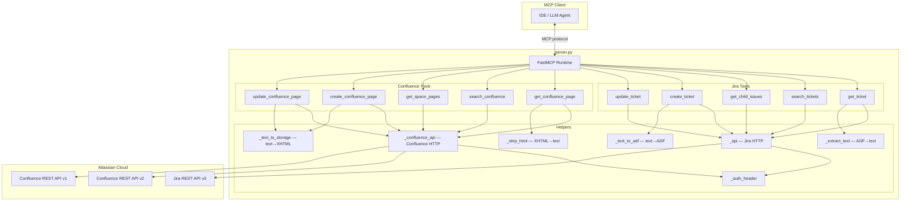

# Atlassian MCP Server — Confluence & Jira Integration

## Design Document

---

## Overview

This design extends the existing `server.py` FastMCP server with five Confluence tools and two Jira write tools. The server already provides three read-only Jira tools (`get_ticket`, `search_tickets`, `get_child_issues`) using stdlib `urllib` with basic auth.

The extension follows the same patterns established in the codebase:
- All HTTP calls go through thin helper functions (`_api` for Jira, new `_confluence_api` for Confluence)
- Authentication reuses the existing `_auth_header()` function and env vars (`JIRA_USER`, `JIRA_API_KEY`, `JIRA_BASE_URL`)
- Each MCP tool is a `@mcp.tool()` decorated function returning a JSON string
- Errors are returned as `{"error": "HTTP {code}", "detail": "..."}` JSON objects

No new dependencies are introduced — the server continues to use `urllib`, `json`, `base64`, and `fastmcp`.

### Key Design Decisions

| Decision | Choice | Rationale |
|---|---|---|
| Confluence API version | v2 (`/wiki/api/v2`) for reads, v1 (`/wiki/rest/api`) for create/update | v2 provides cleaner JSON responses for reads; v1 storage format is simpler for write operations |
| Page body format (read) | Convert storage format XHTML → plain text | Keeps tool output readable for LLM consumers; mirrors existing `_extract_text` for Jira ADF |
| Page body format (write) | Accept plain text, wrap in storage format XHTML | Simplest authoring experience; `<p>` wrapping is sufficient for most documentation |
| Jira description format | Convert plain text → ADF JSON | Jira API v3 requires ADF for description field |
| HTTP library | stdlib `urllib` (existing) | No new dependencies; consistent with current codebase |
| Error handling | Return JSON error objects | Consistent with existing `_api` pattern |

---

## Architecture

The server is a single-file Python application (`server.py`) that exposes MCP tools via FastMCP.



### Request Flow

1. MCP client invokes a tool (e.g. `get_confluence_page(page_id="12345")`)
2. FastMCP dispatches to the decorated function
3. Tool function calls the appropriate HTTP helper (`_api` or `_confluence_api`)
4. Helper constructs URL, attaches auth header, sends request via `urllib`
5. Response JSON is parsed, transformed (text extraction, field selection), and returned as a JSON string

---

## Components and Interfaces

### HTTP Helpers

#### `_confluence_api(path, method="GET", data=None, api_version="v2") -> dict`

Confluence-specific HTTP helper, parallel to the existing `_api` for Jira.

- Prepends `/wiki/api/v2` (default) or `/wiki/rest/api` (when `api_version="v1"`) to the path
- Reuses `_auth_header()` for Basic auth
- Returns parsed JSON on success
- Returns `{"error": "HTTP {code}", "detail": "..."}` on `HTTPError`
- Uses same timeout (30s) and headers as `_api`

#### `_strip_html(html_string) -> str`

Converts Confluence storage format XHTML to plain text.

- Strips HTML tags using a simple regex or `html.parser`
- Decodes HTML entities (`&amp;` → `&`, etc.)
- Preserves line breaks from `<br/>`, `<p>`, `<li>` tags
- Returns clean plain text string

#### `_text_to_storage(text) -> str`

Converts plain text to Confluence storage format.

- Splits text on newlines
- Wraps each non-empty line in `<p>...</p>`
- Returns concatenated XHTML string

#### `_text_to_adf(text) -> dict`

Converts plain text to Atlassian Document Format JSON.

- Splits text on newlines
- Creates a paragraph node for each non-empty line
- Returns ADF document structure: `{"type": "doc", "version": 1, "content": [...]}`

### Confluence Tools

#### `get_confluence_page(page_id: str) -> str`

Fetches a single Confluence page by numeric ID.

- Calls `_confluence_api(f"/pages/{page_id}?body-format=storage")` (v2)
- Extracts: `id`, `title`, `spaceId`, `version.number`, body content
- Converts storage format body to plain text via `_strip_html`
- Returns JSON: `{"id", "title", "space_key", "version", "body"}`

#### `search_confluence(cql: str, max_results: int = 10) -> str`

Searches Confluence using CQL.

- Calls `_confluence_api(f"/search?cql={encoded_cql}&limit={max_results}", api_version="v1")` — search endpoint is more reliable on v1
- Maps each result to: `{"id", "title", "space_key", "last_modified"}`
- Returns JSON array

#### `get_space_pages(space_key: str, max_results: int = 25) -> str`

Lists pages in a Confluence space.

- First resolves space key to space ID via `_confluence_api(f"/spaces?keys={space_key}")`
- Then fetches pages via `_confluence_api(f"/spaces/{space_id}/pages?limit={max_results}")`
- Maps each page to: `{"id", "title", "status"}`
- Returns JSON array

#### `create_confluence_page(space_key: str, title: str, body: str, parent_id: str = "") -> str`

Creates a new page in a Confluence space.

- Resolves space key to space ID
- Builds payload: `{"spaceId", "title", "body": {"representation": "storage", "value": _text_to_storage(body)}, "status": "current"}`
- If `parent_id` is provided, adds `"parentId"` to payload
- Calls `_confluence_api("/pages", method="POST", data=payload)`
- Returns JSON: `{"id", "title", "version"}`

#### `update_confluence_page(page_id: str, title: str, body: str) -> str`

Updates an existing Confluence page.

- First fetches current page to get current version number: `_confluence_api(f"/pages/{page_id}")`
- Builds payload with incremented version: `{"id", "title", "body": {"representation": "storage", "value": _text_to_storage(body)}, "version": {"number": current + 1}, "status": "current"}`
- Calls `_confluence_api(f"/pages/{page_id}", method="PUT", data=payload)`
- Returns JSON: `{"id", "title", "version"}`

### Jira Write Tools

#### `create_ticket(project_key: str, summary: str, issue_type: str, description: str = "", assignee: str = "", priority: str = "") -> str`

Creates a new Jira ticket.

- Builds fields payload: `{"project": {"key"}, "summary", "issuetype": {"name"}}`
- If `description` provided, converts to ADF via `_text_to_adf` and adds to fields
- If `assignee` provided, adds `"assignee": {"accountId": assignee}`
- If `priority` provided, adds `"priority": {"name": priority}`
- Calls `_api("/issue", method="POST", data={"fields": ...})`
- Fetches created issue to return: `{"key", "summary", "status", "type"}`

#### `update_ticket(issue_key: str, summary: str = "", description: str = "", assignee: str = "", priority: str = "", transition: str = "", comment: str = "") -> str`

Updates fields, transitions status, and/or adds a comment on an existing Jira ticket.

- **Field updates**: Builds `fields` dict from non-empty params (summary, description→ADF, assignee→accountId, priority→name). Calls `_api(f"/issue/{issue_key}", method="PUT", data={"fields": ...})` if any fields provided.
- **Transition**: If `transition` provided, fetches available transitions via `_api(f"/issue/{issue_key}/transitions")`, finds matching name (case-insensitive), calls `_api(f"/issue/{issue_key}/transitions", method="POST", data={"transition": {"id": ...}})`. Returns error with valid names if no match.
- **Comment**: If `comment` provided, converts to ADF and calls `_api(f"/issue/{issue_key}/comment", method="POST", data={"body": adf})`.
- Returns updated ticket info via `get_ticket(issue_key)`.

---

## Data Models

### Confluence Page (returned by tools)

```python
{
    "id": str,           # Numeric page ID (e.g. "12345")
    "title": str,        # Page title
    "space_key": str,    # Space key (e.g. "SECENG")
    "version": int,      # Version number
    "body": str          # Plain text content (read operations only)
}
```

### Confluence Search Result

```python
{
    "id": str,           # Page ID
    "title": str,        # Page title
    "space_key": str,    # Space key
    "last_modified": str # ISO 8601 timestamp
}
```

### Confluence Space Page Entry

```python
{
    "id": str,           # Page ID
    "title": str,        # Page title
    "status": str        # "current", "draft", etc.
}
```

### Jira Ticket (returned by create/update)

```python
{
    "key": str,          # Issue key (e.g. "INFOSEC-2239")
    "summary": str,      # Ticket summary
    "status": str,       # Status name (e.g. "Open")
    "assignee": str | None,  # Display name or None
    "priority": str,     # Priority name
    "type": str,         # Issue type name
    "description": str   # Plain text description
}
```

### Confluence API v2 Create/Update Payload

```python
{
    "spaceId": str,
    "title": str,
    "status": "current",
    "parentId": str,     # Optional
    "body": {
        "representation": "storage",
        "value": str     # XHTML storage format
    },
    "version": {         # Update only
        "number": int
    }
}
```

### Jira Create Ticket Payload

```python
{
    "fields": {
        "project": {"key": str},
        "summary": str,
        "issuetype": {"name": str},
        "description": dict,     # ADF document (optional)
        "assignee": {"accountId": str},  # Optional
        "priority": {"name": str}        # Optional
    }
}
```

### Jira Transition Payload

```python
{
    "transition": {
        "id": str  # Transition ID looked up by name
    }
}
```

### Jira Comment Payload

```python
{
    "body": dict  # ADF document
}
```

### URL Parsing

#### `_parse_confluence_url(input_str: str) -> str`

Extracts a numeric page ID from either a raw ID string or a Confluence page URL.

- Accepts raw numeric IDs (e.g. `"12345"`)
- Accepts full Confluence URLs matching the pattern: `https://{instance}/wiki/spaces/{KEY}/pages/{pageId}/{optional-title}`
- Returns the numeric page ID as a string
- Raises `ValueError` with a descriptive message if the input is neither a numeric ID nor a recognized URL pattern

### Install Script (`install.sh`)

A self-contained bash script at the repository root that:

1. Prompts for Atlassian instance URL, email, and API token via `read -p` / `read -sp`
2. Creates `~/.atlassian-mcp/` directory if it doesn't exist
3. Clones or pulls the repository into `~/.atlassian-mcp/`
4. Creates or reuses a Python venv at `~/.atlassian-mcp/` and installs dependencies via `pip install`
5. Writes credentials to `~/.atlassian-mcp/.env` (`JIRA_BASE_URL`, `JIRA_USER`, `JIRA_API_KEY`)
6. Validates credentials by making a test API call (`/rest/api/3/myself`)
7. Creates or updates `~/.kiro/settings/mcp.json` with the server entry (merging with existing config if present)
8. Prints success/failure summary

The script is idempotent — running it again updates dependencies and credentials without recreating the venv.

---

## Correctness Properties

*A property is a characteristic or behavior that should hold true across all valid executions of a system — essentially, a formal statement about what the system should do. Properties serve as the bridge between human-readable specifications and machine-verifiable correctness guarantees.*

### Property 1: Confluence URL parsing extracts correct page ID

*For any* valid Confluence page URL containing a numeric page ID segment, parsing the URL should return exactly that page ID string.

**Validates: Requirements 1.2**

### Property 2: Storage format round trip preserves text content

*For any* plain text string, converting it to Confluence storage format via `_text_to_storage` and then back to plain text via `_strip_html` should produce a string containing all non-empty lines from the original text.

**Validates: Requirements 1.3**

### Property 3: ADF round trip preserves text content

*For any* plain text string, converting it to Atlassian Document Format via `_text_to_adf` and then extracting text via `_extract_text` should produce a string containing all non-empty lines from the original text.

**Validates: Requirements 8.3**

### Property 4: Confluence API helper constructs correct URL prefix

*For any* API path string, calling `_confluence_api` with `api_version="v2"` should construct a URL starting with `{JIRA_BASE_URL}/wiki/api/v2`, and calling with `api_version="v1"` should construct a URL starting with `{JIRA_BASE_URL}/wiki/rest/api`.

**Validates: Requirements 7.1**

### Property 5: HTTP errors produce structured JSON error objects

*For any* HTTP error code and error body returned by the Confluence API, `_confluence_api` should return a dict containing an `"error"` key with the HTTP status code and a `"detail"` key with the error body.

**Validates: Requirements 7.3**

### Property 6: Missing required fields produce descriptive errors

*For any* combination of missing required fields (project key, summary, issue type) when creating a Jira ticket, the tool should return an error message that identifies which field is missing.

**Validates: Requirements 8.6**

### Property 7: Transition name lookup is case-insensitive and correct

*For any* list of available transitions and a query name that matches one of them (ignoring case), the lookup should return the correct transition ID.

**Validates: Requirements 9.3**

---

## Error Handling

All tools follow the same error pattern established by the existing `_api` helper:

| Error Scenario | Behavior |
|---|---|
| HTTP 4xx/5xx from Atlassian API | Return `{"error": "HTTP {code}", "detail": "{response_body}"}` |
| Invalid page ID / URL format | Return `{"error": "Invalid input", "detail": "Expected a numeric page ID or Confluence URL: https://..."}` |
| Missing required field (Jira create) | Return `{"error": "Missing required field", "detail": "{field_name} is required"}` |
| Transition name not found | Return `{"error": "Invalid transition", "detail": "'{name}' not found. Available: {list}"}` |
| Version conflict (Confluence update) | Pass through API 409 response as `{"error": "HTTP 409", "detail": "..."}` |
| Network timeout | `urllib` raises `URLError`; caught and returned as `{"error": "Connection error", "detail": "..."}` |

All error responses are JSON strings, so MCP clients can parse them uniformly.

---

## Testing Strategy

### Unit Tests (example-based)

Unit tests cover specific scenarios, default values, and integration wiring:

- **Default parameter values**: `search_confluence` defaults to 10 results, `get_space_pages` defaults to 25
- **Optional field handling**: `create_ticket` with/without description, assignee, priority; `create_confluence_page` with/without parent_id
- **Response field extraction**: Mock API responses for each tool, verify correct fields are returned
- **Error passthrough**: Mock HTTP errors (404, 403, 409, 500), verify JSON error structure
- **Transition not found**: Verify error lists available transition names
- **URL construction**: Verify `_confluence_api` builds correct URLs for v1 and v2

### Property-Based Tests (fast-check style, via Hypothesis)

Property tests use [Hypothesis](https://hypothesis.readthedocs.io/) (Python PBT library) with a minimum of 100 iterations per property.

Each property test is tagged with a comment referencing the design property:

```python
# Feature: confluence-integration, Property 1: Confluence URL parsing extracts correct page ID
```

Properties to implement:

1. **URL parsing round trip** — Generate random page IDs and space keys, construct valid Confluence URLs, parse them, verify extracted ID matches. (Property 1)
2. **Storage format round trip** — Generate random multi-line text, convert to storage format, strip HTML, verify content preserved. (Property 2)
3. **ADF round trip** — Generate random multi-line text, convert to ADF, extract text, verify content preserved. (Property 3)
4. **Confluence API URL prefix** — Generate random path strings, verify URL prefix for v1 and v2. (Property 4)
5. **HTTP error structure** — Generate random error codes (400-599) and error bodies, mock `urlopen` to raise `HTTPError`, verify returned dict structure. (Property 5)
6. **Missing field validation** — Generate all combinations of present/absent required fields, verify error identifies missing ones. (Property 6)
7. **Transition lookup** — Generate random transition lists and matching query names with varied casing, verify correct ID returned. (Property 7)

### Integration Tests

Integration tests verify end-to-end behavior against mocked Atlassian API responses:

- Full tool invocation for each of the 10 MCP tools
- Credential validation flow in `install.sh`

### Smoke Tests

- `install.sh` creates venv, writes `.env`, updates `mcp.json`
- Server starts successfully with valid configuration
- `_confluence_api` and `_api` use the same `_auth_header`

